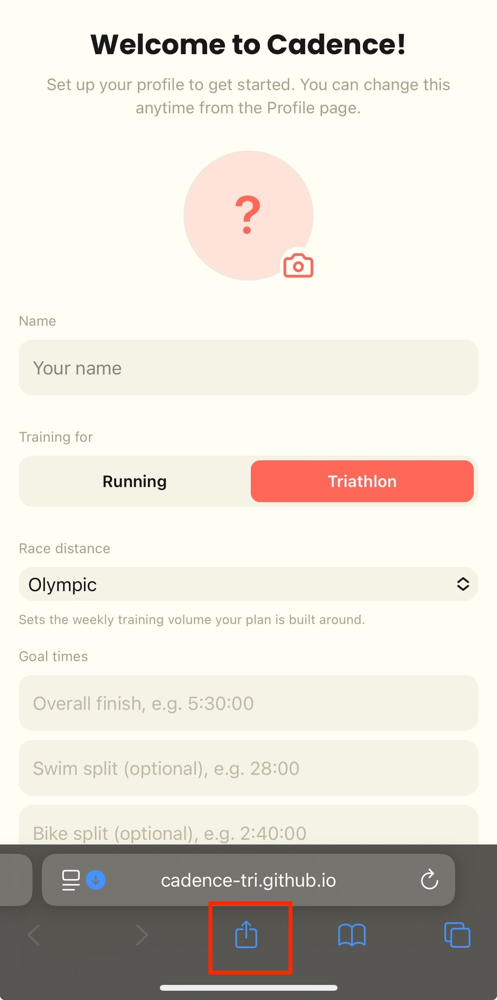
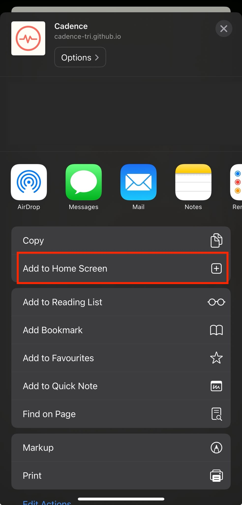

# Cadence


A training log and plan tracker for marathon and triathlon training.

Live at: **https://cadence-tri.github.io/cadence/** (once deployed — see below)

## What it does

- **Daily log** — Overview dashboard (week at a glance, Road to Race
  progress, recovery-week nudges), an Upcoming list grouped by week with
  editable phase labels, and a browsable Training Log of past weeks.
- **Session tracking** — tick off prescribed sets, log free-text feedback
  per session, edit sets inline.
- **Stats** — completion rate by discipline, weekly volume charts,
  gym exercise progression, all filterable by training phase.
- **Plan generation** — builds a complete "check-in" prompt (your race
  goal, availability, and recent training history) that you paste into
  any Claude conversation; paste the reply back in and it's parsed and
  imported automatically. No API key, no server round-trip.
- **Manual entry & file import** — add a session by hand, or import a
  `.md` plan file directly.
- **Backup & Restore** — export your whole log as a JSON file, restore
  from one. This is also how you bring in training history from the
  **native iOS app** — its backup export uses the same JSON shape, so
  export from the iOS app's Profile → Backup & Restore screen and import
  that file here.

## Tech stack

- React + Vite, deployed as a static site
- [Dexie.js](https://dexie.org/) over IndexedDB for local-only storage
- Tailwind CSS v4 for styling (brand tokens in `src/index.css`)
- Recharts for the Stats charts
- `vite-plugin-pwa` for the installable-PWA/service-worker setup

## Local development

```bash
npm install
npm run dev
```

Open the printed local URL. The dev server ignores the `base: '/cadence/'`
path prefix used in production builds, so it just runs at the root.

```bash
npm run build     # production build to dist/
npm run preview   # serve the production build locally, at /cadence/
```

## Installing on iOS

Visit the deployed URL in Safari, tap the Share icon, then **Add to Home
Screen**. It installs like a native app icon and runs full-screen — no
App Store, no sideloading, no certificate to renew.

**Note**: if the "Add to Home Screen" does not appear, you can add it via "Edit actions" at the bottom of the page.


