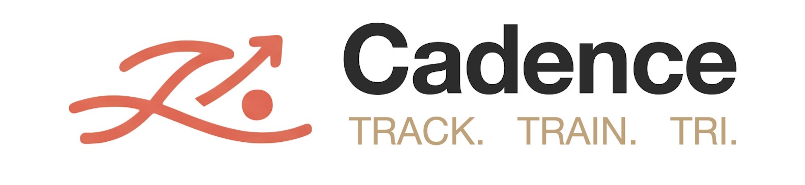
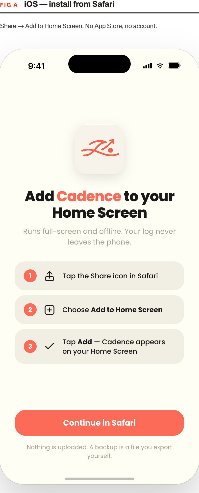
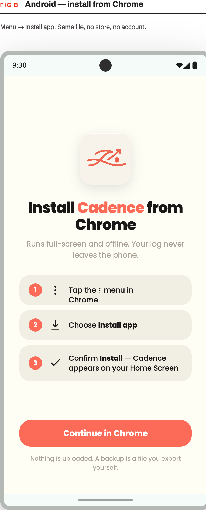

# Cadence



A training log and plan tracker for marathon and triathlon training.

Live at: **https://cadence-tri.github.io/cadence/** (once deployed — see below)

## What it does

- **Evidence-led endurance planning (scheduler v5)** — separate run, bike and
  swim fitness estimates; conservative calibration; optional structured workout
  results; explicit workload/race-specific stages; baseline changes confirmed by
  the athlete. Profile and Coach expose compact Fitness estimates & capacity
  controls. Existing calendar sessions are not rewritten.
- **Season progression** — adaptive marathon peak ranges of 45–55, 55–65 or
  75–85 km/week, selected using experience and capacity, not the goal alone.
  Optional starting mileage and longest-run inputs anchor gradual progression;
  long runs have their own progression, with recovery, taper and race protection.
  These ranges are planning targets, not guaranteed outcomes or mandatory quotas.
- **Phase checkpoints** — one controlled assessment per discipline in each
  development phase, subject to recovery and placement constraints; none in
  taper. Ordinary sessions develop workload and specificity between checkpoints.
- **Swim capacity & technique** — volume fits swim ability, session time and
  pool access instead of cramming an inflated weekly target into one session.
  Two or more swims include one technique-focused session. Timed run/bike/brick
  distances are labelled estimates, not measured performance.

- **Daily log** — Overview dashboard (week at a glance, Road to Race
  progress, recovery-week nudges), an Upcoming list grouped by week with
  editable phase labels, and a browsable Training Log of past weeks.
- **Session tracking** — tick off prescribed sets, log free-text feedback
  and perceived effort per session, review total distance, and edit sets inline.
- **Stats** — completion rate by discipline, weekly volume charts,
  gym exercise progression, all filterable by training phase.
- **Plan generation** — builds a complete "check-in" prompt (your race
  goal, availability, and recent training history) that you paste into
  a compatible AI conversation. A focused prompt includes athlete evidence,
  concise prior endurance prescriptions, prior gym exercise/completion history and upcoming cue
  targets without database metadata or duplicated endurance structures. The
  complete records remain local. The reply supplies coaching text and gym
  exercises while Cadence restores locked endurance prescriptions locally.
  Coach v5 includes a readable response manifest for every scheduled session,
  with an exact total and ordered ID checklist, so endurance sessions cannot be
  hidden inside the packed transport context. Gym lines also fix each session's
  focus, mode, exact workload, movement slots and one compact load action per
  slot. Wrong/missing slots or session IDs are rejected; otherwise
  set/repetition mistakes are corrected locally and reported.
  Paste the reply into Coach for validation and import. The pending block is
  retained on the same device when local storage is available. No API key.
  Prompt size is displayed; model context limits still apply.
- **Add activity** — log an ad-hoc session from Coach or directly from
  Training Log, with the selected log date prefilled.
- **Strength preferences** — choose 1–4 sessions per week in Profile,
  initial setup, or the Coach check-in. One is full body; two are upper/lower;
  three add full body; four use two upper/lower pairs. Each ends with core.
  Recovery uses lighter/shorter sessions; taper and race protection can reduce
  frequency. Scheduling adjustments are shown before the prompt is copied.
  Normal sessions prescribe exactly 3 sets for main and core exercises; recovery
  and taper prescribe exactly 2. After actual loads are logged inline, Cadence
  holds, adds a repetition, or suggests a small load increase only from repeated
  controlled normal-week completions. Suggested and actual loads remain separate;
  recovery/taper logs never replace the normal working baseline.
  Preferences affect the next generated block, not existing calendar entries.
- **Backup & Restore** — export your whole log as a JSON file, restore
  from one. This is also how you bring in training history from the
  **native iOS app** — its backup export uses the same JSON shape, so
  export from the iOS app's Profile → Backup & Restore screen and import
  that file here.

## Tech stack

- React + Vite, deployed as a static site
- [Dexie.js](https://dexie.org/) over IndexedDB for local-only storage
- Tailwind CSS v4 for styling (brand tokens in `src/index.css`)
- Recharts for the Stats charts
- `vite-plugin-pwa` for the installable-PWA/service-worker setup

## Local development

```bash
npm install
npm run dev
```

Open the printed local URL. The dev server ignores the `base: '/cadence/'`
path prefix used in production builds, so it just runs at the root.

```bash
npm run build     # production build to dist/
npm run preview   # serve the production build locally, at /cadence/
```

## Installing on your phone

Visit the deployed URL in Safari (iOS) or Chrome (Android) and follow the instructions below.
It installs like a native app icon and runs full-screen — no App Store, no sideloading, no certificate to renew.

**Note**: if the "Add to Home Screen" does not appear, you can add it via "Edit actions" at the bottom of the page.

<table>
  <tr>
    <td></td>
    <td></td>
  </tr>
</table>
